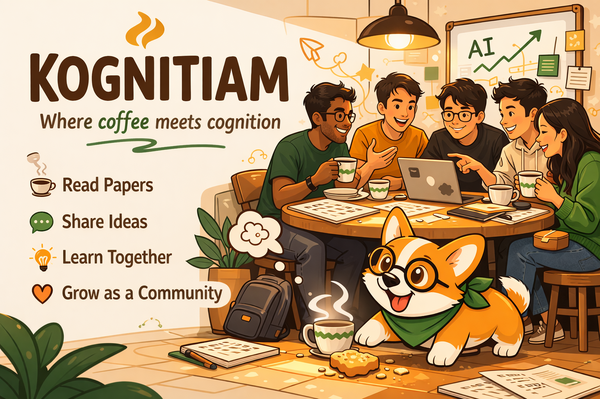

# Kognitiam ☕🧠
### A kopitiam for minds.
**Where coffee meets cognition.**

Kognitiam began on a quiet night in Singapore, when five friends — Sukumar, Praneeth, Charles, Zi Qiang, and Gita — gathered for a serious conversation about AI, work, and what the future might demand of all of us.

The questions were heavy.  
Would our jobs survive?  
How fast was AI really moving?  
What did it mean to stay useful, human, and grounded in a world where intelligence was becoming abundant?

Then, in the middle of that conversation, a small piece of kaya toast fell from the table.

A corgi appeared.

He wasn’t invited. He wasn’t expected. He just showed up, drawn by a crumb, and somehow changed the room. The conversation softened. The fear became breathable. The night became less about panic, and more about people learning together.

That corgi became **Kogi** — the quiet guardian of Kognitiam.

And that night became the seed of a community.

## What is Kognitiam?

Kognitiam is a Singapore-born AI community built around **coffee, conversation, and collective intelligence**.

The name blends **cognition** with **kopitiam** — the local coffeehouse as a social space for gathering, questioning, arguing, learning, and returning. Kognitiam exists for people who want to think seriously about AI without the sterility of a corporate meetup or the hype of a founder circle.

It is a place for:
- reading and discussing AI papers
- sharing demos, experiments, and ideas
- tracking where the field is moving
- helping one another adapt to a changing world
- turning fear into literacy, and literacy into agency

## Why Kognitiam exists

AI is changing the structure of work, knowledge, and creativity faster than most people can process alone.

Kognitiam exists because we believe the response should not be isolation, panic, or passive consumption.

It should be **community**.

We believe intelligence should be social.  
We believe difficult ideas become more useful when discussed openly.  
We believe local communities should have a voice in how the future of AI is understood and shaped.

## Our spirit

Kognitiam is:

- **technical, but open**
- **serious, but warm**
- **local, but forward-looking**
- **curious, not performative**
- **human at the core**

This is not just an AI meetup.  
It is a neighbourhood commons for people trying to learn faster, think better, and face the future together.

---

> **Kognitiam**  
> *Shared tables. Shared thought.*
